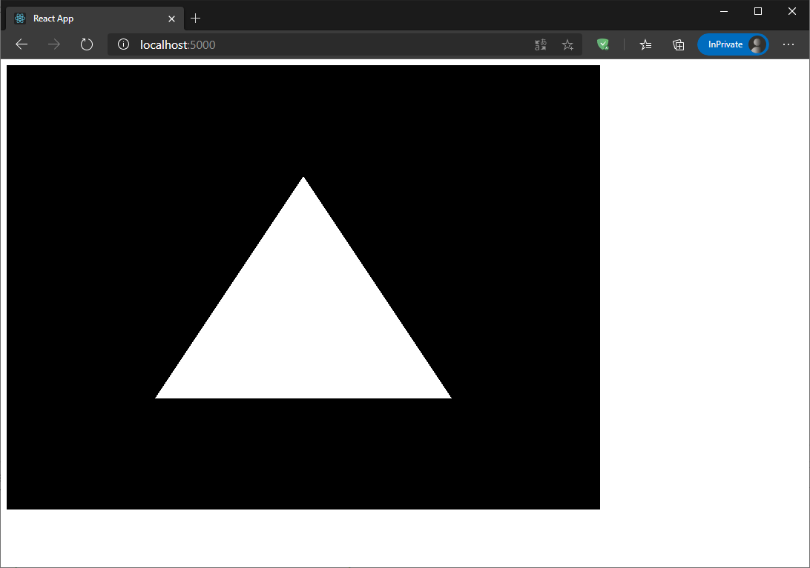

# 基于React的WASM WebGL示例

这是一个基于react的wasm WebGL模块示例，在C++中使用GLFW创建并绘制webgl es3.0画面，并在react中初始化wasm模块时绑定相应canvas。



## C++部分

C++部分是一个cmake项目，理论上可以用以下代码编译

```shell
$ mkdir build
$ cd build
$ emcmake cmake ..
```

但实际上emcmake只是添加了两个cmake编译参数，因此可以直接设置cmake configure参数

```shell
$ cmake -DCMAKE_TOOLCHAIN_FILE=/home/xiaobaigou/emsdk/upstream/emscripten/cmake/Modules/Platform/Emscripten.cmake -DCMAKE_CROSSCOMPILING_EMULATOR="/home/xiaobaigou/emsdk/node/12.18.1_64bit/bin/node"
```

使用此方法需先获得正确的emcmake参数路径

## React部分

将C++部分编译至wasm模块并生成胶水代码。

由于自动生成的胶水代码不符合eslint定义的代码规范，所以需要使用`/* eslint-disable */`关闭整个文件的代码提示以通过编译。

```javascript
/* eslint-disable */
var Module = (function() {
  var _scriptDir = "";
  
  ...
  
export default Module;
/* eslint-disable */
```

由于canvas必须是一个不可变的dom，要防止因为react重新渲染导致的dom变化，需要用useRef获取一个不可变的原始dom。

```javascript
export default function WebGLComponent(props) {
    const canvas = useRef();

    ...

    return (
        <>
            <canvas id="wasm" width={800} height={600} ref={canvas}></canvas>
        </>
    );
}
```

使用effect hook初始化wasm context，需注意default state是undefined，初始化完成后才能调用导出函数

```javascript
    const [context, setContext] = useState(undefined);

    useEffect(() => {
        let Module = { canvas: canvas.current };
        wasmModuleBuilder.default(Module).then((result) => setContext(result));
    }, []);
```

